### Hi, I'm Nubah!

I'm a fourth year Computer Science Honours student at Dalhousie University (she/her), working across software development and machine learning research.

Right now I'm building backend services in C#/.NET on Azure at Quest Software inc., working on my Honours thesis on detecting rare attack types in network intrusion detection, and researching glacier melt patterns with satellite data. I'm also an executive at the Dal Women in Tech Society and the Dal Machine Learning Society.

Open to 2027 new grad software and ML roles.

<a href="https://nafisah-nubah-portfolio.vercel.app/">Portfolio</a> ·
<a href="https://www.linkedin.com/in/nafisah-nubah-3a355829b">LinkedIn</a> ·
<a href="mailto:Nafisah.Nubah@dal.ca">Email</a>
